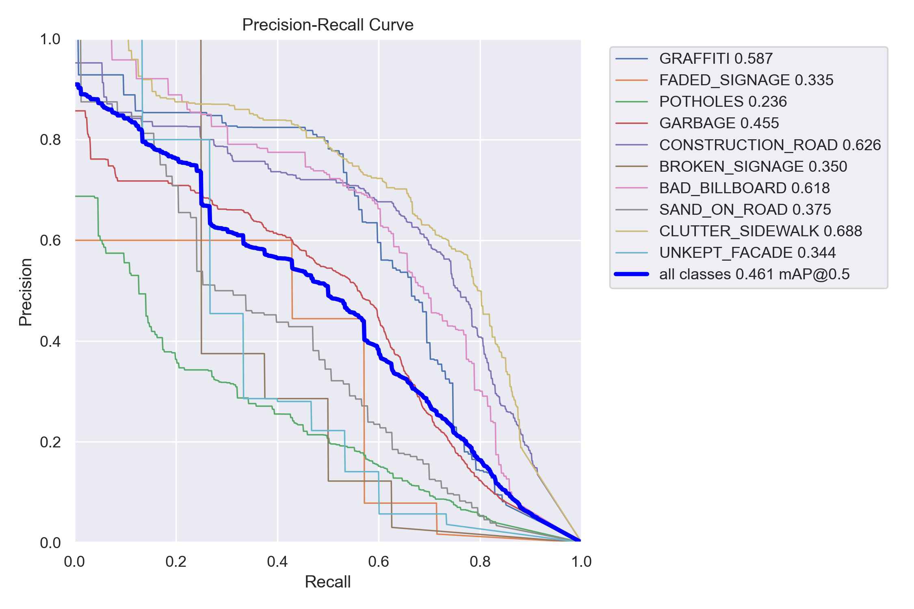
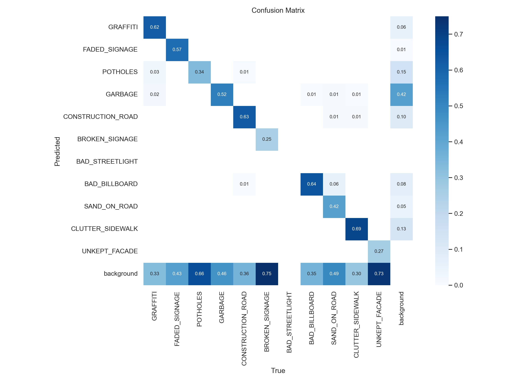
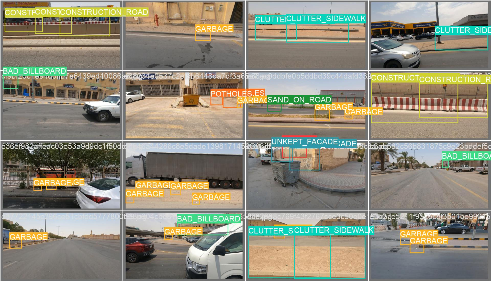
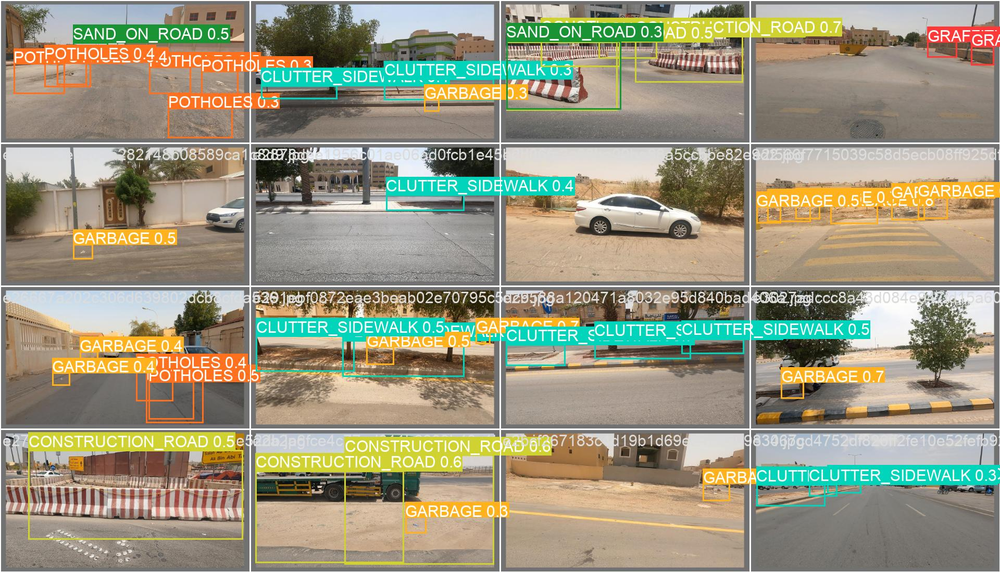

# Observer (لمّاح)

Observer (لمّاح) is a real-time visual pollution detection system developed using YOLOv8. This project aims to automate the detection and visualization of various urban visual pollution elements such as graffiti, potholes, garbage, and more. The system is designed to improve urban aesthetics and contribute to the quality of life, public health, and sustainability goals outlined in Saudi Vision 2030.

## Table of Contents

1. [Introduction](#introduction)
2. [Problem Statement](#problem-statement)
3. [Objectives](#objectives)
4. [Methodology](#methodology)
    - [Dataset](#dataset)
    - [Model Selection](#model-selection)
    - [Model Training](#model-training)
5. [Results](#results)
    - [Overall Performance](#overall-performance)
    - [Class-based Acceptance](#class-based-acceptance)
    - [Detection Samples](#detection-samples)
6. [Conclusion and Future Work](#conclusion-and-future-work)
7. [Appendix](#appendix)

## Introduction

Urban areas often face visual pollution from elements such as graffiti, potholes, and garbage. These elements can reduce the visual appeal of locations, affecting their perceived value and the well-being of citizens. The Observer project addresses this issue using a machine learning model to detect and visualize these elements in real-time, aiding in the efficient organization and supervision of clean-up initiatives.

## Problem Statement

Traditional methods of detecting visual pollution, like manual surveys, are impractical for modern urban environments due to their vast expanse, time-consuming nature, and labor intensity. The Observer project aims to develop a real-time detection system to overcome these challenges, accounting for the complex and diverse nature of urban environments and visual pollution elements.

## Objectives

1. **Develop a YOLOv8-based model** to accurately detect and visualize various elements of visual pollution in real-time.
2. **Automate the detection process** to make it more efficient and less resource-intensive.
3. **Demonstrate the model's effectiveness** in various environments and device inputs.
4. **Support clean-up initiatives** by identifying areas with prevalent visual pollution.
5. **Encourage further research and innovation** in visual pollution detection.

## Methodology

### Dataset

The dataset was sourced from the Saudi Authority for Data and Artificial Intelligence (SDAIA) Smartathon and includes diverse instances of visual pollution. The dataset was augmented to balance underrepresented classes, resulting in 13,391 images.

| Type               | Number of Instances |
|--------------------|---------------------|
| GARBAGE            | 8597                |
| CONSTRUCTION ROAD  | 2730                |
| POTHOLES           | 2625                |
| CLUTTER_SIDEWALK   | 2253                |
| BAD BILLBOARD      | 1555                |
| GRAFFITI           | 1124                |
| SAND ON ROAD       | 748                 |
| UNKEPT FACADE      | 127                 |
| FADED SIGNAGE      | 107                 |
| BROKEN SIGNAGE     | 83                  |
| BAD STREETLIGHT    | 1                   |

### Model Selection

YOLOv8 was selected for its ability to process images in real-time and perform simultaneous detection and classification of multiple objects. The model structure is visualized in the architecture diagram provided by GitHub user RangeKing.


### Model Training

The dataset was split into 80% training, 19% validation, and 1% testing. The model used a deep convolutional neural network backbone and employed transfer learning with pre-trained weights from the COCO dataset. Hyperparameters and augmentation techniques were tuned iteratively to optimize performance.

## Results

### Overall Performance

The model's performance was evaluated using precision, recall, and mAP@0.5. The precision-recall curve and confusion matrix are shown below:




### Class-based Acceptance

Each class of visual pollution was assigned a specific confidence threshold to ensure a precision of 60% or higher.

### Detection Samples

Examples of detected elements are shown below:




## Conclusion and Future Work

The Observer project successfully utilized YOLOv8 for real-time visual pollution detection. Future enhancements include:

1. Exploring more complex model architectures.
2. Collecting a broader and cleaner dataset.
3. Conducting extensive hyperparameter tuning.

These improvements aim to further increase detection performance and contribute to a more visually appealing urban environment.


## Appendix

### Hyperparameters

| Hyperparameter | Value          |
|----------------|----------------|
| task           | 'detect'       |
| mode           | 'train'        |
| model          | 'yolov8x.pt'   |
| data           | 'data.yaml'    |
| epochs         | 60             |
| patience       | 10             |
| batch          | 8              |
| imgsz          | 640            |
| device         | 0              |
| workers        | 8              |
| optimizer      | SGD            |
| augment        | true           |
| iou            | 0.7            |

### Augmentation Techniques

To enhance the model's detection capabilities and address the imbalance in the dataset, various augmentation techniques were employed. These techniques help the model generalize better by exposing it to a wide range of variations in the training data.

1. Horizontal Flip
2. Shift Scale Rotate
3. Random Brightness
4. CLAHE
5. Emboss
6. Piecewise Affine
7. Perspective
8. Cutout
9. RGB Shift
10. Hue Saturation Value
11. Random Contrast
12. Random Fog
13. To Gray

### Usage

To use the Observer system for detecting visual pollution in real-time, follow these steps:

1. **Install Dependencies**: Ensure you have Python, PyTorch, and other necessary libraries installed.
2. **Clone the Repository**: Clone the project repository to your local machine.
3. **Prepare the Dataset**: Collect and prepare your dataset according to the structure mentioned in the report.
4. **Train the Model**: Train the model using the provided training script.
5. **Run Detection**: Use the trained model to run real-time detection on new images or video streams.

```bash
# Clone the repository
git clone https://github.com/AmeerAlmaamari/Real-Time-Visual-Pollution-Detection.git
cd Real-Time-Visual-Pollution-Detection

# Install dependencies
pip install -r requirements.txt

# Prepare and augment the dataset
python prepare_dataset.py

# Train the model
python train.py --data data.yaml --epochs 60

# Run detection
python detect.py --source path/to/your/image_or_video

### Contribution

Contributions to the Observer project are welcome. If you have any suggestions, improvements, or bug fixes, please submit a pull request. Ensure to follow the coding guidelines and provide a detailed description of your changes.


---

By using the Observer system, we aim to contribute to creating cleaner and more visually appealing urban environments, aligning with the goals of Saudi Vision 2030.


